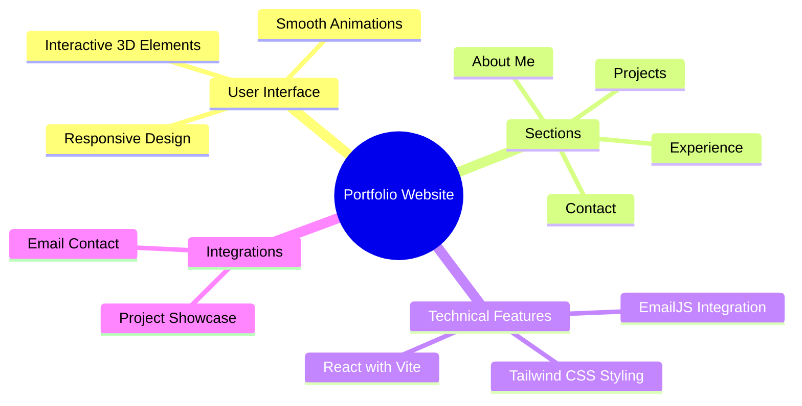

  <a href="#features">Features</a> •
  <a href="#demo">Demo</a> •
  <a href="#screenshots">Screenshots</a> •
  <a href="#installation">Installation</a> •
  <a href="#tech-stack">Tech Stack</a>

A modern, responsive portfolio website showcasing professional experience, projects, and skills. Built with React, Vite, and Tailwind CSS, featuring smooth animations and interactive 3D elements. ✨

## ✨ Features

## 💻 Tech Stack

<table align="center">
  <tr>
    <td align="center" width="96">
      
       React
    </td>
      <td align="center" width="96">
      
       Vite
    </td>
    <td align="center" width="96">
      
       Tailwind CSS
    </td>
      <td align="center" width="96">
      
       Three.js
    </td>
  </tr>
</table>

## ⚡ Core Features

- 📱 Responsive Design

  - Mobile-first approach
  - Seamless experience across all devices
  - Adaptive layouts and components

- 🎯 Dynamic Content

  - Interactive project showcase
  - Engaging experience section
  - Animated skill representations

- 🎨 Modern UI/UX

  - Smooth Framer Motion animations
  - Intuitive navigation
  - Clean and professional design
  - Interactive 3D elements using Three.js

- ✉️ Email Integration
  - Contact form using EmailJS

## 📄 License

MIT License © [Lohit Kolluri](LICENSE)

